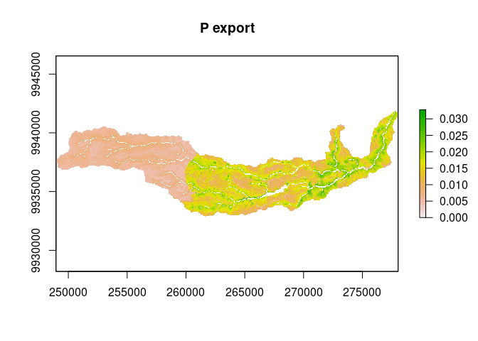

<!-- README.md is generated from README.Rmd. Please edit that file -->

# rinvest

<!-- badges: start -->
<!-- [](https://github.com/jsta/rinvest/actions) -->

[](https://www.tidyverse.org/lifecycle/#experimental)
<!-- badges: end -->

## Installation

Requires that Anaconda (or Miniconda) be installed and that it can be
detected by the `reticulate` package. Check if this is the case with:

``` r
nchar(reticulate::conda_binary()) > 0
#> [1] TRUE
```

You can install `rinvest` with:

``` r
# install.packages("devtools")
devtools::install_github("jsta/rinvest")
install_invest()
```

## Example

``` r
library(rinvest)
#> Loading required package: reticulate

data_dir <- system.file("extdata/NDR", package = "rinvest")
args <- list(
  "workspace_dir" = "workspace",
  "dem_path" = paste0(data_dir, "/DEM_gura.tif"),
  "lulc_path" = paste0(data_dir, "/land_use_gura.tif"),
  "runoff_proxy_path" = paste0(data_dir, "/precipitation_gura.tif"),
  "watersheds_path" = paste0(data_dir,  "/watershed_gura.shp"),
  "biophysical_table_path" = paste0(data_dir,  "/biophysical_table_gura.csv"),
  "calc_p" = TRUE,
  "calc_n" = FALSE,
  "threshold_flow_accumulation" = 1000,
  "k_param" = 2,
  "subsurface_eff_p" = 0.5,
  "subsurface_critical_length_p" = 25
)

ndr_file_paths <- ndr(args, overwrite = TRUE)
```

``` r
ndr_file_paths
#>  [1] "workspace/intermediate_outputs"                                   
#>  [2] "workspace/intermediate_outputs/cache_dir"                         
#>  [3] "workspace/intermediate_outputs/cache_dir/aligned_dem.tif"         
#>  [4] "workspace/intermediate_outputs/cache_dir/aligned_lulc.tif"        
#>  [5] "workspace/intermediate_outputs/cache_dir/aligned_runoff_proxy.tif"
#>  [6] "workspace/intermediate_outputs/cache_dir/export_p.pickle"         
#>  [7] "workspace/intermediate_outputs/cache_dir/filled_dem.tif"          
#>  [8] "workspace/intermediate_outputs/cache_dir/slope.tif"               
#>  [9] "workspace/intermediate_outputs/cache_dir/subsurface_load_p.pickle"
#> [10] "workspace/intermediate_outputs/cache_dir/surface_load_p.pickle"   
#> [11] "workspace/intermediate_outputs/cache_dir/taskgraph_data.db"       
#> [12] "workspace/intermediate_outputs/crit_len_p.tif"                    
#> [13] "workspace/intermediate_outputs/d_dn.tif"                          
#> [14] "workspace/intermediate_outputs/d_up.tif"                          
#> [15] "workspace/intermediate_outputs/dist_to_channel.tif"               
#> [16] "workspace/intermediate_outputs/eff_p.tif"                         
#> [17] "workspace/intermediate_outputs/effective_retention_p.tif"         
#> [18] "workspace/intermediate_outputs/flow_accumulation.tif"             
#> [19] "workspace/intermediate_outputs/flow_direction.tif"                
#> [20] "workspace/intermediate_outputs/ic_factor.tif"                     
#> [21] "workspace/intermediate_outputs/load_p.tif"                        
#> [22] "workspace/intermediate_outputs/modified_load_p.tif"               
#> [23] "workspace/intermediate_outputs/ndr_p.tif"                         
#> [24] "workspace/intermediate_outputs/runoff_proxy_index.tif"            
#> [25] "workspace/intermediate_outputs/s_accumulation.tif"                
#> [26] "workspace/intermediate_outputs/s_bar.tif"                         
#> [27] "workspace/intermediate_outputs/s_factor_inverse.tif"              
#> [28] "workspace/intermediate_outputs/stream.tif"                        
#> [29] "workspace/intermediate_outputs/sub_load_p.tif"                    
#> [30] "workspace/intermediate_outputs/sub_ndr_p.tif"                     
#> [31] "workspace/intermediate_outputs/surface_load_p.tif"                
#> [32] "workspace/intermediate_outputs/thresholded_slope.tif"             
#> [33] "workspace/p_export.tif"                                           
#> [34] "workspace/watershed_results_ndr.dbf"                              
#> [35] "workspace/watershed_results_ndr.prj"                              
#> [36] "workspace/watershed_results_ndr.shp"                              
#> [37] "workspace/watershed_results_ndr.shx"
```

``` r
library(raster)

plot(raster("workspace/p_export.tif"), main = "P export")
```



## Links

<http://releases.naturalcapitalproject.org/invest-userguide/latest/>

<https://community.naturalcapitalproject.org/>

<https://github.com/natcap/invest>
