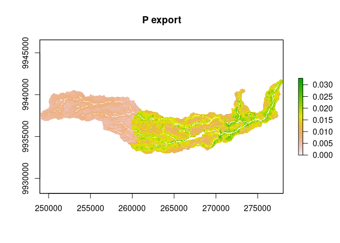

```{r, include = FALSE}
knitr::opts_chunk$set(
  collapse = TRUE,
  comment = "#>"
)
```

```{r setup}
library(rinvest)
```

---
output: github_document
---

```{r example}
library(rinvest)
ndr <- invest$ndr$ndr
data_dir <- system.file("extdata/NDR", package = "rinvest")

args <- dict(
  "workspace_dir" = "workspace",
  "dem_path" = paste0(data_dir, "/DEM_gura.tif"),
  "lulc_path" = paste0(data_dir, "/land_use_gura.tif"),
  "runoff_proxy_path" = paste0(data_dir, "/precipitation_gura.tif"),
  "watersheds_path" = paste0(data_dir,  "/watershed_gura.shp"),
  "biophysical_table_path" = paste0(data_dir,  "/biophysical_table_gura.csv"),
  "calc_p" = TRUE,
  "calc_n" = FALSE,
  "threshold_flow_accumulation" = 1000,
  "k_param" = 2,
  "subsurface_eff_p" = 0.5,
  "subsurface_critical_length_p" = 25
)

unlink("workspace", recursive = TRUE)
ndr$execute(args)
```

```{r }
dir("workspace")
```

```{r, message=FALSE, eval=FALSE}
library(raster)

plot(raster("workspace/p_export.tif"), main = "P export")
```



```{r, echo=FALSE}
unlink("workspace", recursive = TRUE)
```
